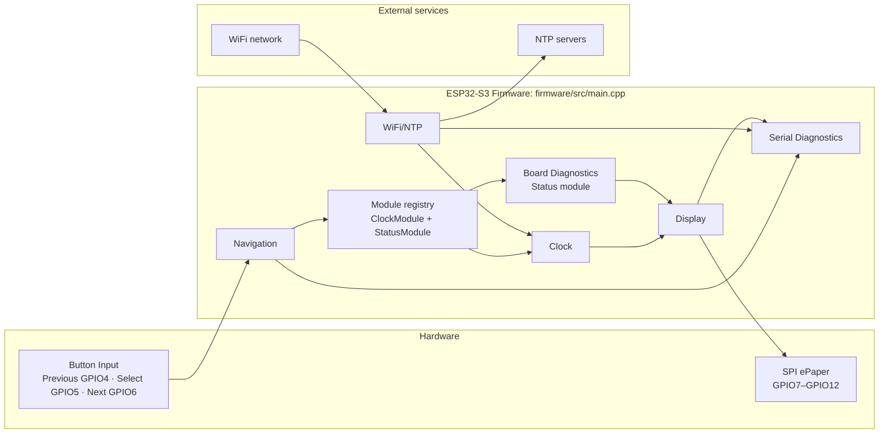

# Architecture

## Current Implementation (Version 0.4)

HomeOS Version 0.4 remains a small, single-file firmware implementation, now with
a fixed two-module registry. `firmware/src/main.cpp` owns Button Input,
Navigation, Clock, Board Diagnostics, Display, WiFi/NTP, and Serial Diagnostics.
The target architecture below remains a future direction; its proposed layers do
not yet exist as separate firmware modules.



Current behavior:

- Button Input uses active-low GPIO inputs with internal pull-ups and 50 ms debounce.
- Navigation lets Previous and Next wrap through Clock and Status; Select redraws the active module.
- The Clock module owns minute refresh and WiFi/NTP retry work; the Status module owns board diagnostics.
- WiFi/NTP uses locally configured credentials when present and retries synchronization every five minutes after failure.
- Display uses the verified SPI wiring and full refresh only; each draw ends in ePaper hibernation.
- Serial Diagnostics reports startup board information, button activity, WiFi/NTP state, display activity, and a five-second heartbeat.

For a file and function-level view, see [Code-Map.md](Code-Map.md). The optional local interactive companion is [homeos-code-map.html](visualizations/homeos-code-map.html).

## Overview

HomeOS should be designed as a small firmware platform with modules, services, drivers, and clear ownership boundaries.

This document describes the target architecture. It is the direction the project should grow toward, not a list of everything that must exist in Version 0.1.

High-level structure:

```text
HomeOS
|
+-- Core
|   +-- App lifecycle
|   +-- Scheduler
|   +-- Event bus
|   +-- Configuration
|   +-- Logging
|
+-- Drivers
|   +-- ePaper display
|   +-- Buttons
|   +-- Buzzer
|   +-- Sensors
|
+-- Services
|   +-- WiFi
|   +-- Time sync
|   +-- Telegram
|   +-- OTA
|   +-- Storage
|
+-- UI
|   +-- Layout
|   +-- Fonts
|   +-- Icons
|   +-- Theme
|
+-- Modules
    +-- Clock
    +-- Weather
    +-- Calendar
    +-- Todo
    +-- Tank
    +-- Electricity
```

## Incremental Architecture Rule

Version 0.1 should remain minimal:

- board configuration
- serial logging
- display driver
- one test screen

Scheduler, event bus, configuration service, module abstraction, Telegram service, OTA, storage, and other shared services should be introduced only when a roadmap milestone actually requires them.

Avoid creating empty abstractions or placeholder frameworks merely because they appear in the target diagram. Empty layers can make a beginner firmware project harder to understand and harder to debug.

Refactoring at a planned milestone is acceptable and preferable to premature complexity. For example, it is fine if Version 0.1 has one simple display test, and Version 0.4 introduces the formal module manager after the display and buttons are already working.

The architecture direction should remain stable, but implementation should grow incrementally.

## Layer Responsibilities

### Drivers

Drivers talk directly to hardware. A display driver knows pins and refresh commands. A button driver knows how to read a GPIO pin and debounce it. A buzzer driver knows how to generate tones.

Drivers should not know about weather, calendars, Telegram, or business logic.

### Services

Services provide shared capabilities to modules:

- WiFi connection
- time and date
- Telegram messages
- settings storage
- OTA updates
- network API requests
- logging

Services should be reusable. For example, both the Weather module and Calendar module can use the same network service.

### UI Layer

The UI layer draws common screen elements:

- header
- footer
- status indicators
- alerts
- progress bars
- lists
- icons
- charts

The UI layer should hide the details of ePaper drawing from modules where possible.

### Modules

Modules are the user-facing screens. Each module should be small and focused.

Suggested module interface:

```cpp
class Module {
public:
  virtual const char* id() const = 0;
  virtual const char* title() const = 0;
  virtual void begin() = 0;
  virtual void update() = 0;
  virtual void draw(DisplayContext& display) = 0;
  virtual void onButton(ButtonEvent event) = 0;
  virtual bool hasAlert() const = 0;
};
```

The exact code can change, but the idea should remain: modules plug into the system instead of controlling everything themselves.

## Display Modes

HomeOS should support three viewing modes.

### Slideshow Mode

The device rotates through enabled modules at a configured interval, such as 30, 60, or 120 seconds.

Good for:

- kitchen display
- family dashboard
- passive information viewing

### Fixed Mode

The user pins one module on screen.

Good for:

- water tank monitoring during motor operation
- clock view
- weather screen on rainy days
- electricity outage view

### Smart Mode

The device normally shows a default module, but temporarily switches to important screens when something needs attention.

Examples:

- tank below 20 percent
- rain expected soon
- reminder due
- power failed
- Telegram message received

After the alert window expires, the device returns to the previous screen.

## Event Model

Events can let modules react without tightly coupling to each other. An event bus is a possible internal mechanism for this, but it is not mandatory from the first version.

Example event types:

- `ButtonPressed`
- `ButtonLongPressed`
- `WiFiConnected`
- `WiFiDisconnected`
- `TimeSynced`
- `TelegramCommandReceived`
- `ReminderDue`
- `TankLevelChanged`
- `PowerFailed`
- `PowerRestored`

When the firmware has enough features to justify it, this avoids one large file where every feature directly calls every other feature.

## Configuration

Configuration should be stored in flash memory using a structured approach, not hardcoded everywhere.

Examples:

- WiFi credentials
- Telegram bot token
- Telegram chat ID
- slideshow interval
- enabled modules
- default module
- alert volume
- timezone
- weather location

Sensitive values should not be committed to a public repository.

## Recommended Development Framework

Use PlatformIO if possible. It makes dependency management, build environments, board configuration, and project structure cleaner than a basic Arduino IDE sketch.

Arduino framework can still be used inside PlatformIO, which keeps beginner-friendly libraries while giving the project a professional structure.

## Initial Folder Structure

```text
HomeOS/
|
+-- firmware/
|   +-- platformio.ini
|   +-- src/
|   |   +-- main.cpp
|   |   +-- core/
|   |   +-- drivers/
|   |   +-- services/
|   |   +-- ui/
|   |   +-- modules/
|   +-- include/
|   +-- lib/
|   +-- test/
|
+-- docs/
|   +-- Project.md
|   +-- Architecture.md
|   +-- Hardware.md
|   +-- Wiring.md
|
+-- hardware/
|   +-- datasheets/
|   +-- photos/
|   +-- pinouts/
|
+-- enclosure/
+-- assets/
+-- README.md
```
