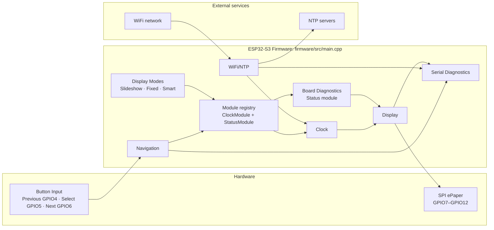

# Architecture

## Current Implementation (Version 0.5)

HomeOS Version 0.5 remains a small, single-file firmware implementation with a
fixed two-module registry. `firmware/src/main.cpp` owns Button Input,
Navigation, Display Modes, Clock, Board Diagnostics, Display, WiFi/NTP, and
Serial Diagnostics. The target architecture below remains a future direction;
its proposed layers do not yet exist as separate firmware modules.



Current behavior:

- Button Input uses active-low GPIO inputs with internal pull-ups and 50 ms debounce.
- Navigation lets Previous and Next wrap through Clock and Status; Select redraws the active module.
- `kDisplayMode` selects Slideshow, Fixed, or Smart at firmware build time. Slideshow changes modules every 60 seconds; Fixed retains the module selected by Previous or Next; Smart retains that manual selection except for a temporary alert override.
- Every registered module receives `update(now)` each loop. The Clock module therefore keeps its minute refresh and WiFi/NTP retry work while Status is temporarily visible.
- Status owns board diagnostics and is the current alerting module: when configured WiFi/NTP is unhealthy, Smart displays it once for 15 seconds during that uninterrupted failure, then restores the previously displayed module.
- WiFi/NTP uses locally configured credentials when present and retries synchronization every five minutes after failure.
- Display uses the verified SPI wiring and full refresh only; each draw ends in ePaper hibernation.
- Serial Diagnostics reports startup board information, button activity, WiFi/NTP state, display activity, and a five-second heartbeat.

For a file and function-level view, see [Code-Map.md](Code-Map.md). The optional local interactive companion is [homeos-code-map.html](visualizations/homeos-code-map.html).

## Overview

HomeOS should be designed as a small firmware platform with modules, services, drivers, and clear ownership boundaries.

This document describes the target architecture. It is the direction the project should grow toward, not a list of everything that must exist in Version 0.1.

High-level structure:

```text
HomeOS
|
+-- Core
|   +-- App lifecycle
|   +-- Scheduler
|   +-- Event bus
|   +-- Configuration
|   +-- Logging
|
+-- Drivers
|   +-- ePaper display
|   +-- Buttons
|   +-- Buzzer
|   +-- Sensors
|
+-- Services
|   +-- WiFi
|   +-- Time sync
|   +-- Telegram
|   +-- OTA
|   +-- Storage
|
+-- UI
|   +-- Layout
|   +-- Fonts
|   +-- Icons
|   +-- Theme
|
+-- Modules
    +-- Clock
    +-- Weather
    +-- Calendar
    +-- Todo
    +-- Tank
    +-- Electricity
```

## Incremental Architecture Rule

Version 0.1 should remain minimal:

- board configuration
- serial logging
- display driver
- one test screen

Scheduler, event bus, configuration service, module abstraction, Telegram service, OTA, storage, and other shared services should be introduced only when a roadmap milestone actually requires them.

Avoid creating empty abstractions or placeholder frameworks merely because they appear in the target diagram. Empty layers can make a beginner firmware project harder to understand and harder to debug.

Refactoring at a planned milestone is acceptable and preferable to premature complexity. For example, it is fine if Version 0.1 has one simple display test, and Version 0.4 introduces the formal module manager after the display and buttons are already working.

The architecture direction should remain stable, but implementation should grow incrementally.

## Layer Responsibilities

### Drivers

Drivers talk directly to hardware. A display driver knows pins and refresh commands. A button driver knows how to read a GPIO pin and debounce it. A buzzer driver knows how to generate tones.

Drivers should not know about weather, calendars, Telegram, or business logic.

### Services

Services provide shared capabilities to modules:

- WiFi connection
- time and date
- Telegram messages
- settings storage
- OTA updates
- network API requests
- logging

Services should be reusable. For example, both the Weather module and Calendar module can use the same network service.

### UI Layer

The UI layer draws common screen elements:

- header
- footer
- status indicators
- alerts
- progress bars
- lists
- icons
- charts

The UI layer should hide the details of ePaper drawing from modules where possible.

### Modules

Modules are the user-facing screens. Each module should be small and focused.

Suggested module interface:

```cpp
class Module {
public:
  virtual const char* id() const = 0;
  virtual const char* title() const = 0;
  virtual void begin() = 0;
  virtual void update() = 0;
  virtual void draw(DisplayContext& display) = 0;
  virtual void onButton(ButtonEvent event) = 0;
  virtual bool hasAlert() const = 0;
};
```

The exact code can change, but the idea should remain: modules plug into the system instead of controlling everything themselves.

## Display Modes

HomeOS should support three viewing modes.

### Slideshow Mode

The device rotates through registered modules at a firmware-configured interval.
Version 0.5 uses `kSlideshowIntervalMs`, currently 60 seconds. Manual Previous
and Next navigation still works and restarts the slideshow interval.

Good for:

- kitchen display
- family dashboard
- passive information viewing

### Fixed Mode

The user pins one module on screen. Version 0.5 does not add a settings menu:
Previous and Next select the pinned module, and it stays on screen until the
user selects another one.

Good for:

- water tank monitoring during motor operation
- clock view
- weather screen on rainy days
- electricity outage view

### Smart Mode

The device normally retains the module selected by the user, but temporarily
switches to an alerting module when something needs attention. Version 0.5
implements the smallest real alert source: Status requests an alert when local
WiFi credentials are configured and Clock's WiFi/NTP status is not synced.
The override lasts `kSmartAlertDurationMs`, currently 15 seconds, and occurs
once per uninterrupted failure so it does not continually refresh an ePaper
screen. A later recovery followed by another failure can raise a new alert.

Examples:

- tank below 20 percent
- rain expected soon
- reminder due
- power failed
- Telegram message received

After the alert window expires, the device returns to the previous screen.
No event bus, scheduler, persistence, notification transport, or additional
hardware is introduced for this milestone.

## Event Model

Events can let modules react without tightly coupling to each other. An event bus is a possible internal mechanism for this, but it is not mandatory from the first version.

Example event types:

- `ButtonPressed`
- `ButtonLongPressed`
- `WiFiConnected`
- `WiFiDisconnected`
- `TimeSynced`
- `TelegramCommandReceived`
- `ReminderDue`
- `TankLevelChanged`
- `PowerFailed`
- `PowerRestored`

When the firmware has enough features to justify it, this avoids one large file where every feature directly calls every other feature.

## Configuration

Configuration should be stored in flash memory using a structured approach, not hardcoded everywhere.

Examples:

- WiFi credentials
- Telegram bot token
- Telegram chat ID
- slideshow interval
- enabled modules
- default module
- alert volume
- timezone
- weather location

Sensitive values should not be committed to a public repository.

## Recommended Development Framework

Use PlatformIO if possible. It makes dependency management, build environments, board configuration, and project structure cleaner than a basic Arduino IDE sketch.

Arduino framework can still be used inside PlatformIO, which keeps beginner-friendly libraries while giving the project a professional structure.

## Initial Folder Structure

```text
HomeOS/
|
+-- firmware/
|   +-- platformio.ini
|   +-- src/
|   |   +-- main.cpp
|   |   +-- core/
|   |   +-- drivers/
|   |   +-- services/
|   |   +-- ui/
|   |   +-- modules/
|   +-- include/
|   +-- lib/
|   +-- test/
|
+-- docs/
|   +-- README.md
|   +-- CHANGELOG.md
|   +-- Project.md
|   +-- Architecture.md
|   +-- Hardware.md
|   +-- Wiring.md
|
+-- hardware/
|   +-- datasheets/
|   +-- photos/
|   +-- pinouts/
|
+-- enclosure/
+-- assets/
+-- AGENTS.md
```

# Post-v1.0 Multi-Device Architectural Seam

HomeOS v1.0 is intentionally a single-device platform. Multi-device communication
is a future, post-v1.0 capability. Versions 0.5 through 1.0 should preserve a
small number of boundaries so that multi-device support can be added later as a
subsystem rather than requiring a rewrite.

> Preserve the seam; do not implement the subsystem.

This section records architectural direction only. It does not authorize peer
discovery, pairing, peer registries, device-to-device messaging, delivery
receipts, synchronization, voice-note transfer, a broker, or any related
framework before v1.0.

## Future Device Identity

Future HomeOS devices will distinguish a stable machine identity from a
user-editable display name:

```text
device_id = stable machine identity
friendly_name = user-editable name such as Kitchen or Bedroom
```

A room or friendly name must not become the device's permanent identity, and a
future `device_id` should survive renaming. The identity algorithm is deferred.
Raw MAC addresses must not become an application-wide identity dependency; they
may inform a future identity decision, but that decision has not been made.
No device identity is needed or implemented for the v0.5-v1.0 milestones.

## Future Messaging and Network Boundaries

Modules should not become permanently coupled to a particular message transport.
When a current milestone introduces notifications or Telegram, keep
transport-specific behavior concentrated rather than spreading calls such as
`telegram.sendMessage(...)` throughout modules. Introduce a messaging service
only when that milestone has a real need for one.

```text
Module
   |
Messaging / Notification capability
   |
Transport implementation
   +-- Telegram
   +-- Future Local P2P
   +-- Future optional server/broker
```

Modules remain local and single-device through v1.0. They must not need to know
peer IP addresses, mDNS hostnames, discovery protocols, HTTP details, retry
timing, or peer online/offline state. Those concerns belong in future services
or transport components. Likewise, when current milestones need persistence,
avoid scattering arbitrary filesystem ownership across modules, but do not add a
speculative storage abstraction.

An event bus remains optional. Future distributed events may eventually include
peer and message state, but event infrastructure is introduced only when current
complexity makes direct calls difficult to maintain.

## Future Hardware Capability Direction

Future HomeOS units may differ: some may have a battery, microphone, speaker,
external storage, touch, deep sleep, or partial-refresh support. A future model
might describe capabilities such as `hasBattery`, `hasMicrophone`,
`hasSpeaker`, `hasExternalStorage`, `hasTouch`, `supportsDeepSleep`, and
`supportsPartialRefresh`. Do not introduce a capability framework until at least
two real HomeOS hardware configurations need different behavior.

## Post-v1.0 Discovery, Trust, and Messaging Direction

The current preferred direction, not a protocol specification, is:

```text
HomeOS devices
      |
same local Wi-Fi network
      |
mDNS / DNS-SD discovery
      |
HomeOS service advertisement
      |
peer approval / trust
      |
direct P2P communication
```

mDNS/DNS-SD is preferred over a custom discovery protocol. DLNA is not required,
and normal local HomeOS communication must not require a Raspberry Pi or central
server. A server or broker can be considered later only if a real requirement
justifies it. Discovery must not automatically establish trust: future states
may include `Discovered`, `Approved / Trusted`, `Ignored`, and `Offline`, with
user approval required before private content is exchanged. Cryptographic pairing
is intentionally deferred.

A future message lifecycle may look like:

```text
Bedroom
   |
record voice note
   |
send directly to Kitchen
   |
Kitchen stores message
   |
Kitchen returns DELIVERED
   |
user plays message
   |
Kitchen sends HEARD acknowledgement
   |
Bedroom displays heard state
```

Possible future states are `Pending`, `Delivered`, `Heard`, and `Failed`. These
are conceptual only; no message storage, retry, delivery, or acknowledgement
model is implemented before v1.0.

Future voice notes are asynchronous voice messaging, not a live intercom: a
device may record a short (about 10-20 second) note, hold it locally, transfer it
over the home network, notify the destination, allow playback, and acknowledge
playback. Microphones, codecs, audio formats, SD hardware, amplifiers, and live
full-duplex audio are outside this scope. Telegram may eventually participate in
the same logical messaging system alongside local P2P; a message may originate
from another HomeOS unit, Telegram, a local module, or a future transport.

## Multi-Device Architecture Invariants

1. HomeOS v1.0 is single-device; multi-device communication is post-v1.0.
2. Modules must not contain peer-network topology or direct transport details.
3. Modules should not become directly coupled to individual message transports.
4. Friendly names must not be treated as permanent machine identity.
5. Transport-specific networking belongs in services or drivers, not application modules.
6. Storage implementation details should not leak throughout application code.
7. Event infrastructure is introduced only when current complexity requires it.
8. Capability infrastructure is introduced only when multiple real hardware variants require it.
9. Future extensibility never justifies unnecessary complexity before v1.0.
10. HomeOS must reach a stable, useful single-device v1.0 before multi-device functionality is implemented.
