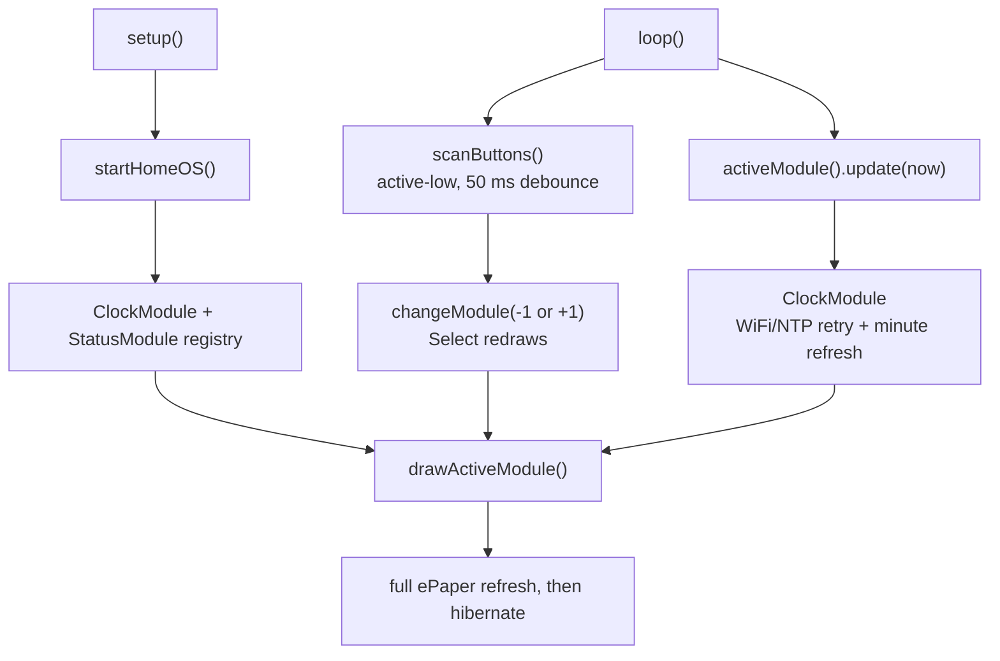

# Code Map

## Version 0.4 Firmware Flow

## File Responsibilities

| File | Responsibility |
|---|---|
| `firmware/src/main.cpp` | Version 0.4 application: startup diagnostics, display, WiFi/NTP clock, debounced buttons, module registry, Clock module, and Status diagnostics module. |
| `firmware/include/config.example.h` | Non-secret example for optional local WiFi configuration. |
| `platformio.ini` | Edgehax S3-PRO build environment and GxEPD2 dependency. |

## Current Module Model

`Module` has `name()`, `draw()`, and `update(now)`. `modules[]` contains static
instances of `ClockModule` and `StatusModule`; `activeModuleIndex` selects one.
`drawActiveModule()` initializes the verified ePaper driver, draws the selected
module, and hibernates it. The Clock module is the only module with periodic work.

Buttons remain direct and hardware-specific: Previous GPIO4, Select GPIO5, and
Next GPIO6 use `INPUT_PULLUP`, active-low presses, and the existing 50 ms debounce.
The verified SPI ePaper mapping remains GPIO7-GPIO12 and uses full refresh only.
