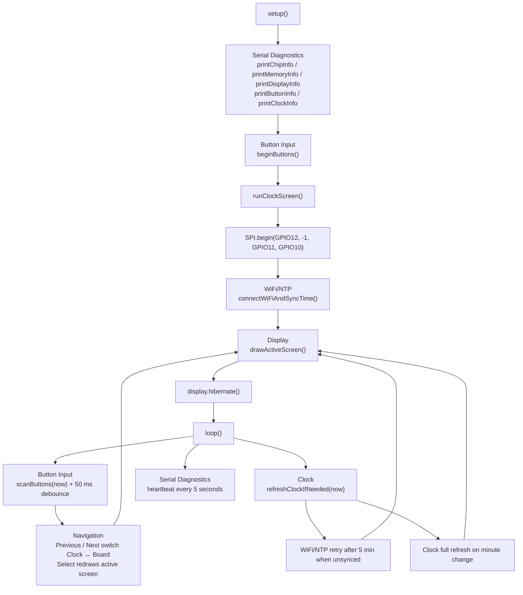

# HomeOS Code Map

This is the verified Version 0.3 implementation map. It describes current code,
not the future modular direction in [Architecture.md](Architecture.md).

## Execution Flow

## File Inventory

| File | Responsibility | Important implementation | Dependencies and interfaces |
|---|---|---|---|
| `platformio.ini` | Defines the single PlatformIO environment and build settings. | `edgehax_s3_pro_diagnostics`; 16 MB flash and OPI PSRAM settings; `GxEPD2` dependency. | Arduino on `esp32-s3-devkitc-1`; serial/upload on `COM7`; GxEPD2 library. |
| `firmware/src/main.cpp` | Entire Version 0.3 application: startup, Button Input, Navigation, Clock, Board Diagnostics, Display, WiFi/NTP, and Serial Diagnostics. | `setup()`, `loop()`, screen drawing, button scan, WiFi/NTP connection. | Arduino, ESP chip APIs, `WiFi`, `SPI`, `time`, GxEPD2; buttons GPIO4–GPIO6 and ePaper GPIO7–GPIO12. |
| `firmware/include/config.local.h` | Ignored, local-only WiFi credential definition. It is optional and must never be committed. | Defines `HOMEOS_WIFI_SSID` and `HOMEOS_WIFI_PASSWORD` locally when WiFi/NTP is enabled. | Included only when present using `__has_include`; consumed by `hasWiFiCredentials()` and `connectWiFiAndSyncTime()`. No credentials belong in this map. |

## Function and State Inventory

### Startup and Serial Diagnostics

`setup()` starts 115200-baud serial output, prints startup diagnostics, initializes Button Input with `beginButtons()`, then calls `runClockScreen()`.

- `printChipInfo()`, `printMemoryInfo()`, `printDisplayInfo()`, `printButtonInfo()`, and `printClockInfo()` write verified status to serial.
- `printBytes()` is a helper used by `printMemoryInfo()`.
- `lastHeartbeatMs` lets `loop()` log its Serial Diagnostics heartbeat every five seconds.

### Button Input and Navigation

`ButtonState` stores each button’s name, GPIO pin, action, stable state, last raw state, and last change time. `buttons[]` maps Previous/Select/Next to GPIO4/GPIO5/GPIO6. Inputs are active-low and initialized with `INPUT_PULLUP`.

- `beginButtons()` configures each input and establishes its initial state.
- `scanButtons(now)` applies the 50 ms debounce interval (`kButtonDebounceMs`) and calls `handleButtonPress()` only on a stable press.
- `handleButtonPress()` owns button behavior: Previous and Next call `changeScreen()`; Select calls `drawActiveScreen()`.
- `changeScreen()` updates `activeScreen`, logs its name with `screenName()`, and redraws only if the screen changes.
- `ButtonAction` identifies `kPrevious`, `kSelect`, and `kNext`; `Screen` identifies `kClock` and `kBoard`.

### Clock and WiFi/NTP

`ClockStatus clockStatus` records whether credentials are missing, WiFi failed, time sync failed, or time synchronized. `hasWiFiCredentials()` checks the optional local configuration without exposing it.

- `connectWiFiAndSyncTime()` attempts station WiFi connection, configures IST and the two NTP servers, waits within defined timeouts, then returns a `ClockStatus`. It is called at startup and by retry logic.
- `refreshClockIfNeeded(now)` is called by `loop()`. It retries WiFi/NTP every five minutes when needed and redraws the Clock when the rendered minute changes after the one-minute refresh interval.
- `clockStatusMessage()` supplies the user-facing status for the Clock screen.
- State: `lastClockRefreshMs`, `lastClockSyncAttemptMs`, and `lastRenderedMinute` support refresh and retry decisions.

### Display and Screens

`runClockScreen()` initializes SPI with the verified ePaper pins, synchronizes WiFi/NTP, and draws the initial screen. `drawActiveScreen()` initializes the ePaper, dispatches according to `activeScreen`, then always calls `display.hibernate()`.

- `drawClockScreen()` renders current local time or setup status using full refresh.
- `drawBoardScreen()` renders board model, flash, PSRAM, and button summary using full refresh.
- `drawCenteredText()` and `drawRightText()` are layout helpers used by both screen draws.
- `display` is the GxEPD2 driver instance. GPIO7=BUSY, GPIO8=DC, GPIO9=RST, GPIO10=CS, GPIO11=MOSI/DIN, GPIO12=SCK/CLK.

## Ownership Summary

| Component | Current owner | Calls / is called by |
|---|---|---|
| Button Input | `buttons[]`, `beginButtons()`, `scanButtons()` | `setup()` initializes; `loop()` scans; `scanButtons()` calls `handleButtonPress()`. |
| Navigation | `handleButtonPress()`, `changeScreen()`, `activeScreen` | Button Input calls it; it invokes Display through `drawActiveScreen()`. |
| Clock | `connectWiFiAndSyncTime()`, `refreshClockIfNeeded()`, `drawClockScreen()` | Startup and `loop()` call it; it uses WiFi/NTP and Display. |
| Board Diagnostics | `drawBoardScreen()` and startup print functions | Display dispatch calls it; startup calls serial diagnostic functions. |
| Display | `runClockScreen()`, `drawActiveScreen()`, draw helpers | Startup, Navigation, and Clock refresh call it; it uses SPI/ePaper. |
| WiFi/NTP | `hasWiFiCredentials()`, `connectWiFiAndSyncTime()` | `runClockScreen()` and `refreshClockIfNeeded()` call it; uses local credentials, WiFi, NTP. |
| Serial Diagnostics | `print*()` functions and heartbeat block | `setup()`, button/navigation, WiFi/NTP, Clock, and Display paths write messages. |
