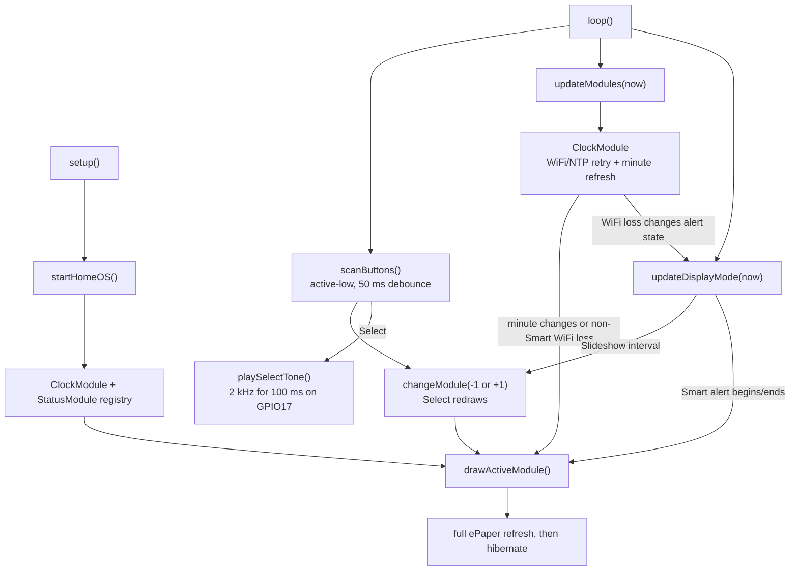

# Code Map

## Version 0.6 Firmware Flow

## File Responsibilities

| File | Responsibility |
|---|---|
| `firmware/src/main.cpp` | Version 0.6 application: startup diagnostics, display modes, WiFi/NTP clock, debounced buttons, one short GPIO17 Select tone, module registry, Clock module, and Status diagnostics/alert module. |
| `firmware/include/config.example.h` | Non-secret example for optional local WiFi configuration. |
| `platformio.ini` | Edgehax S3-PRO build environment and GxEPD2 dependency. |

## Current Module Model

`Module` has `name()`, `draw()`, `update(now)`, and a default-false `hasAlert()`.
`modules[]` contains static instances of `ClockModule` and `StatusModule`;
`activeModuleIndex` selects one and `updateModules(now)` updates both each loop.
`drawActiveModule()` initializes the verified ePaper driver, draws the selected
module, and hibernates it. The Clock module is the only module with periodic work:
it performs one full refresh when the actual local-time minute differs from the
minute it last rendered, independent of when the user opened Clock. After a
successful sync, `refreshClockIfNeeded(now)` also detects loss of the WiFi
connection, changes `clockStatus` to `kWiFiConnectFailed`, and schedules the
existing five-minute WiFi/NTP retry path.

`kDisplayMode` selects one build-time mode. Slideshow uses
`kSlideshowIntervalMs` (60 seconds) to call the existing `changeModule(1)`.
Fixed leaves the module selected by Previous or Next visible. Smart uses
`StatusModule::hasAlert()` for configured WiFi/NTP failures, stores
`smartAlertPreviousModuleIndex`, shows Status for `kSmartAlertDurationMs` (15
seconds), then redraws the prior module. The smart alert is latched until the
failure clears, preventing repeated full-refresh overrides.

Buttons remain direct and hardware-specific: Previous GPIO4, Select GPIO5, and
Next GPIO6 use `INPUT_PULLUP`, active-low presses, and the existing 50 ms debounce.
The verified SPI ePaper mapping remains GPIO7-GPIO12 and uses full refresh only.
Select calls `playSelectTone()` before the existing redraw. When `kSoundEnabled`
is true, Arduino `tone()` requests 2 kHz for 100 ms on GPIO17 asynchronously;
`beginBuzzer()` sets the signal low during startup. The separate low-side driver,
not GPIO17, carries the buzzer-coil current. No alert tone, notification queue,
or general buzzer abstraction exists.
