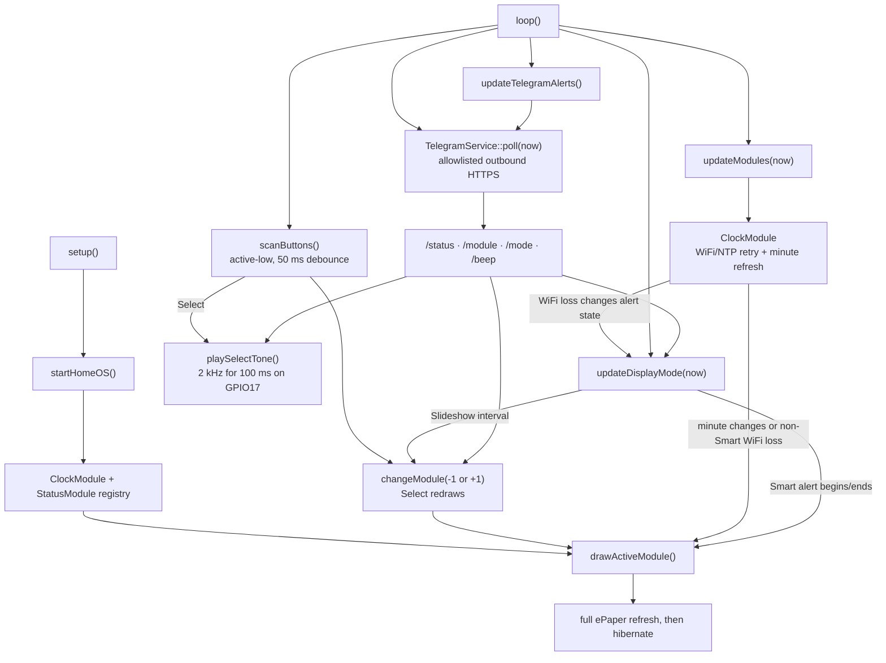

# Code Map

## Version 0.7 Firmware Flow

```mermaid
flowchart TD
  Setup["setup()"] --> Start["startHomeOS()"]
  Start --> Registry["ClockModule + StatusModule registry"]
  Registry --> Draw["drawActiveModule()"]
  Loop["loop()"] --> Buttons["scanButtons()\nactive-low, 50 ms debounce"]
  Buttons --> Navigation["changeModule(-1 or +1)\nSelect redraws"]
  Navigation --> Draw
  Buttons -->|Select| Tone["playSelectTone()\n2 kHz for 100 ms on GPIO17"]
  Loop --> Update["updateModules(now)"]
  Update --> Clock["ClockModule\nWiFi/NTP retry + minute refresh"]
  Clock -->|minute changes or non-Smart WiFi loss| Draw
  Clock -->|WiFi loss changes alert state| Modes
  Loop --> Modes["updateDisplayMode(now)"]
  Modes -->|Slideshow interval| Navigation
  Modes -->|Smart alert begins/ends| Draw
  Loop --> Telegram["TelegramService::poll(now)\nallowlisted outbound HTTPS"]
  Telegram --> Commands["/status · /module · /mode · /beep"]
  Commands --> Navigation
  Commands --> Modes
  Commands --> Tone
  Loop --> Alerts["updateTelegramAlerts()"]
  Alerts --> Telegram
  Draw --> Display["full ePaper refresh, then hibernate"]
```

## File Responsibilities

| File | Responsibility |
|---|---|
| `firmware/src/main.cpp` | Version 0.7 application: startup diagnostics, runtime display modes, WiFi/NTP clock, debounced buttons, unchanged GPIO17 Select tone, module registry, command handling, and WiFi/NTP alert-state tracking. |
| `firmware/include/telegram_service.h` | Narrow Telegram transport interface: local allowlist, polling, replies, and alerts. |
| `firmware/src/telegram_service.cpp` | Certificate-validated Telegram polling, exact private-chat allowlist checks, generic-safe serial diagnostics, and outbound messages. |
| `firmware/include/config.example.h` | Non-secret example for local WiFi and Telegram configuration. |
| `platformio.ini` | Edgehax S3-PRO build environment plus GxEPD2 and UniversalTelegramBot dependencies. |

## Current Module Model

`Module` has `name()`, `draw()`, `update(now)`, and a default-false `hasAlert()`.
`modules[]` contains static instances of `ClockModule` and `StatusModule`;
`activeModuleIndex` selects one and `updateModules(now)` updates both each loop.
`drawActiveModule()` initializes the verified ePaper driver, draws the selected
module, and hibernates it. The Clock module is the only module with periodic work:
it performs one full refresh when the actual local-time minute differs from the
minute it last rendered, independent of when the user opened Clock. After a
successful sync, `refreshClockIfNeeded(now)` also detects loss of the WiFi
connection, changes `clockStatus` to `kWiFiConnectFailed`, and schedules the
existing five-minute WiFi/NTP retry path.

`displayMode` selects one RAM-only runtime mode and starts as
`kDefaultDisplayMode`, currently Slideshow. Slideshow uses
`kSlideshowIntervalMs` (60 seconds) to call the existing `changeModule(1)`.
Fixed leaves the module selected by Previous or Next visible. Smart uses
`StatusModule::hasAlert()` for configured WiFi/NTP failures, stores
`smartAlertPreviousModuleIndex`, shows Status for `kSmartAlertDurationMs` (15
seconds), then redraws the prior module. The smart alert is latched until the
failure clears, preventing repeated full-refresh overrides.

`TelegramService` is enabled only when both local Telegram configuration values
are non-empty. Its `begin()` configures the library's Telegram root certificate;
`poll(now, networkReady)` runs once per second only after WiFi/NTP is healthy.
Its first poll records and discards queued pre-boot updates. It records the last
handled update ID so a repeated Telegram delivery cannot issue a second command
reply. It identifies a private message by matching its chat and sender IDs,
accepts exact allowlisted private chat IDs from the local comma-separated list,
rejects group and supergroup updates, and
forwards text to `handleTelegramCommand()`. The handler exposes `/status`, the
two existing module names, three runtime modes, and `/beep`; it neither accepts
arbitrary module names nor changes the Version 0.6 tone implementation. A
WiFi/NTP failure cannot send a Telegram alert while offline. Recovery causes one
delivery attempt and no alert retry queue is retained.

Buttons remain direct and hardware-specific: Previous GPIO4, Select GPIO5, and
Next GPIO6 use `INPUT_PULLUP`, active-low presses, and the existing 50 ms debounce.
The verified SPI ePaper mapping remains GPIO7-GPIO12 and uses full refresh only.
Select calls `playSelectTone()` before the existing redraw. When `kSoundEnabled`
is true, Arduino `tone()` requests 2 kHz for 100 ms on GPIO17 asynchronously;
`beginBuzzer()` initializes LEDC channel 0, then sets the signal low during
startup. The separate low-side driver, not GPIO17, carries the buzzer-coil
current. No alert tone, notification queue, or general buzzer abstraction exists.
